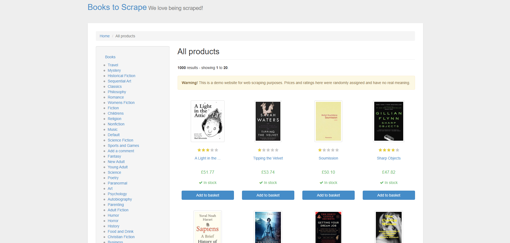
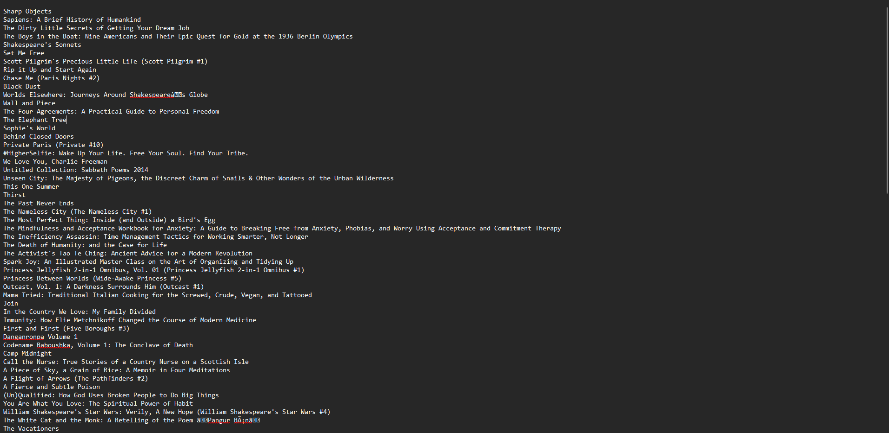

# Extractor de datos web (Web Scraping)

Este proyecto es un extractor de datos web (web scraper) desarrollado en Python. Utiliza bibliotecas como BeautifulSoup, Lxml y Requests para extraer información de páginas web de manera eficiente.

Extrae unicamente el nombre de los libros que cuentan con una calificación de 4 estrellas o superior y los guarda en un archivo llamado titulos.txt.
